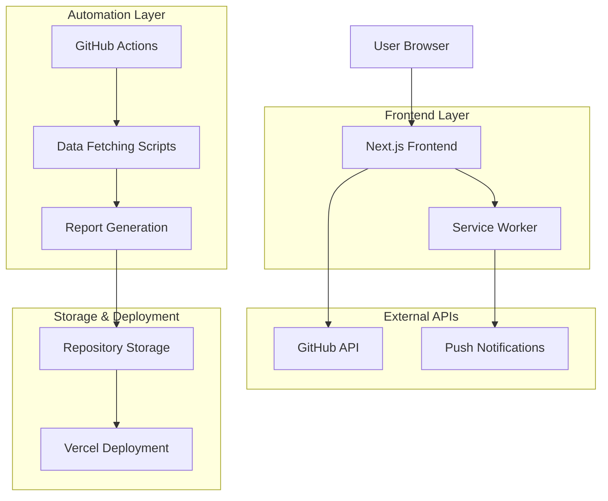
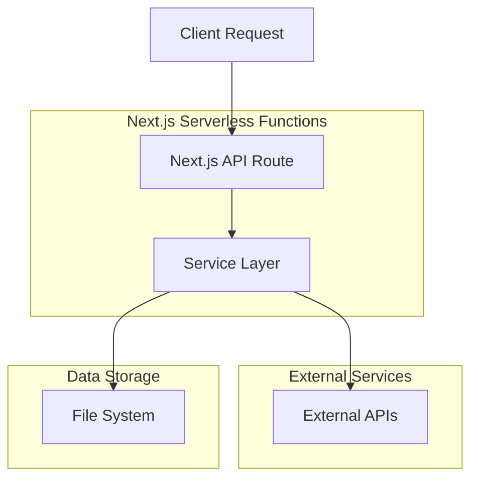
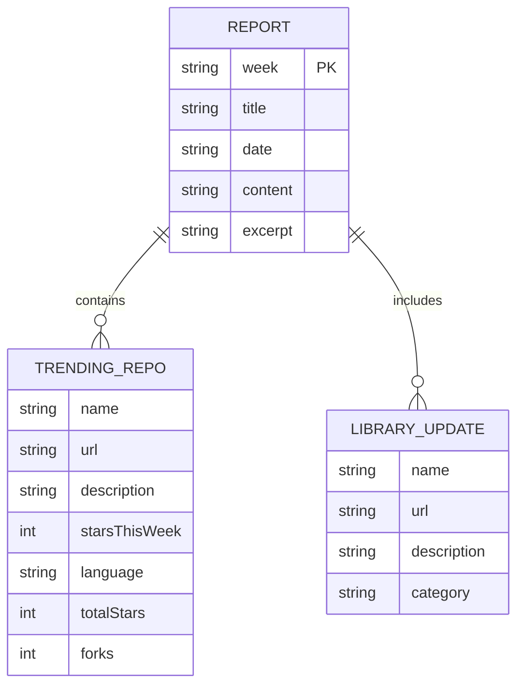

## 1. Architecture design



## 2. Technology Description

- **Frontend**: Next.js 16 + TypeScript + Tailwind CSS
- **Initialization Tool**: create-next-app
- **Backend**: None (serverless functions with Next.js API routes)
- **Data Sources**: GitHub API, GitHub Trending (web scraping)
- **Automation**: GitHub Actions
- **Deployment**: Vercel
- **Notifications**: Web Push API with Service Worker

## 3. Route definitions

| Route | Purpose |
|-------|---------|
| / | Home page displaying latest report and archive |
| /blog/[week] | Individual weekly report page with markdown content |
| /api/subscribe | Push notification subscription endpoint |
| /api/notify | Send push notifications to subscribers |

## 4. API definitions

### 4.1 Push Notification APIs

**Subscribe to notifications**
```
POST /api/subscribe
```

Request:
```json
{
  "endpoint": "https://fcm.googleapis.com/fcm/send/...",
  "keys": {
    "p256dh": "...",
    "auth": "..."
  }
}
```

Response:
```json
{
  "success": true
}
```

**Send notifications**
```
POST /api/notify
```

Response:
```json
{
  "success": true,
  "notificationsSent": 42
}
```

### 4.2 Data Fetching Functions

**GitHub Trending Repositories**
```typescript
interface TrendingRepo {
  name: string
  url: string
  description: string
  starsThisWeek: number
}
```

**awesome-react Library Updates**
```typescript
interface Library {
  name: string
  url: string
  description: string
  category: string
}
```

**Repository Details**
```typescript
interface RepoDetails {
  name: string
  fullName: string
  description: string | null
  stars: number
  forks: number
  language: string | null
  updatedAt: string
  url: string
  homepage: string | null
}
```

## 5. Server architecture diagram



## 6. Data model

### 6.1 Data model definition



### 6.2 Data Definition Language

**Reports Storage (File System)**
Reports are stored as markdown files in `/reports` directory with frontmatter:

```markdown
---
title: "React Weekly Trends - [Date]"
week: "2025-week-47"
date: "2025-11-28T00:00:00.000Z"
---

# Report Content
```

**Subscription Storage (JSON File)**
Push notification subscriptions are stored in `subscriptions.json`:

```json
[
  {
    "endpoint": "https://fcm.googleapis.com/fcm/send/...",
    "keys": {
      "p256dh": "...",
      "auth": "..."
    }
  }
]
```

## 7. Development Environment Configuration

### 7.1 ESLint Configuration
- **Config file**: `eslint.config.mjs`
- **Base config**: eslint-config-ts-prefixer
- **Ignores**: node_modules, .next, build artifacts

### 7.2 Package.json Scripts
```json
{
  "scripts": {
    "dev": "next dev",
    "build": "next build",
    "start": "next start",
    "lint": "eslint .",
    "lint:fix": "eslint . --fix",
    "generate-report": "tsx scripts/generate-report.ts",
    "type-check": "tsc --noEmit"
  }
}
```

### 7.3 Environment Variables
```bash
NEXT_PUBLIC_VAPID_PUBLIC_KEY=your-public-key
VAPID_PRIVATE_KEY=your-private-key
GITHUB_TOKEN=your-github-token
```

## 8. Automation Workflow

### 8.1 GitHub Actions Schedule
- **Trigger**: Every Sunday at 00:00 UTC (Monday 9:00 JST)
- **Manual trigger**: Available via workflow_dispatch
- **Process**: Install dependencies → Generate report → Commit → Deploy → Notify

### 8.2 Report Generation Pipeline
1. Fetch GitHub trending repositories (React-related)
2. Fetch awesome-react library updates
3. Generate markdown report with insights
4. Save to `/reports` directory
5. Commit to repository

## 9. Security Considerations

### 9.1 API Keys Management
- GitHub token stored in GitHub Secrets
- VAPID keys configured in environment variables
- No sensitive data exposed in client-side code

### 9.2 Data Validation
- Input validation for API routes
- Error handling for external API failures
- Rate limiting consideration for GitHub API