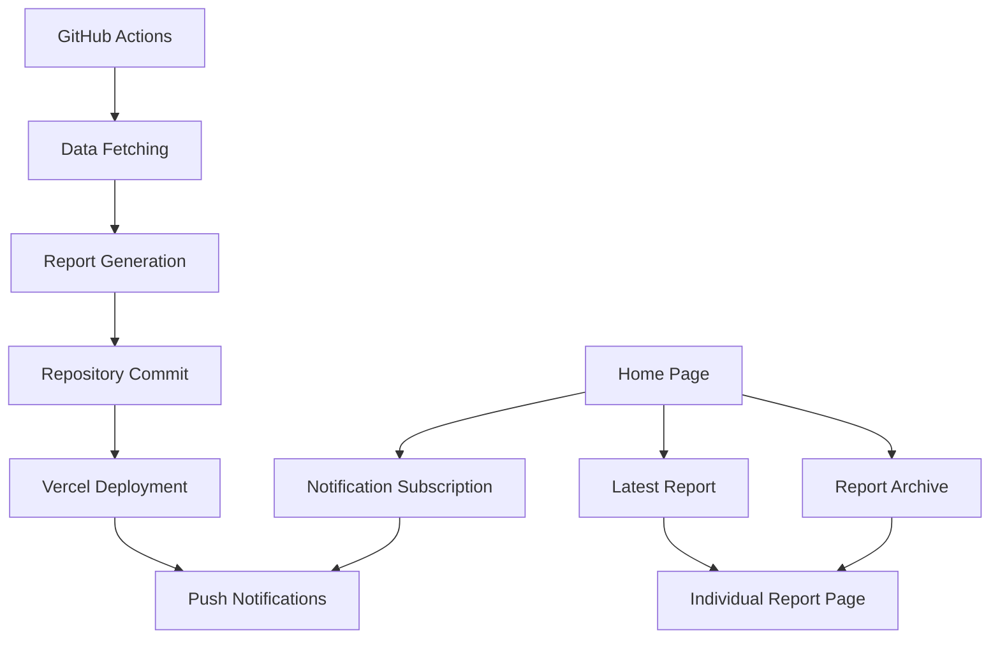

## 1. Product Overview

React Weekly Trends is an automated platform that generates weekly trend reports for the React ecosystem. The system automatically collects data from GitHub trending repositories and awesome-react libraries, creates comprehensive markdown reports, and publishes them through a Next.js web application with push notification capabilities.

The platform solves the problem of staying updated with React ecosystem trends by providing automated weekly reports, helping developers discover new libraries, trending repositories, and important updates in the React community.

## 2. Core Features

### 2.1 User Roles

| Role | Registration Method | Core Permissions |
|------|---------------------|------------------|
| Visitor | No registration required | Browse reports, view trends, subscribe to notifications |
| Subscriber | Browser-based push notification subscription | Receive desktop notifications for new reports |

### 2.2 Feature Module

Our React Weekly Trends requirements consist of the following main pages:

1. **Home page**: Latest weekly report display, notification subscription, archive of past reports
2. **Weekly report page**: Detailed markdown report with trending repositories, library updates, and insights
3. **API endpoints**: Push notification subscription and notification sending services

### 2.3 Page Details

| Page Name | Module Name | Feature description |
|-----------|-------------|---------------------|
| Home page | Hero section | Display main title with gradient background, automatic notification button integration |
| Home page | Latest report | Show most recent weekly report with title, excerpt, and read more link |
| Home page | Archive section | Grid layout of past reports with navigation to individual reports |
| Home page | Notification subscription | Browser push notification subscription with service worker integration |
| Report page | Report header | Display report title, publication date, and metadata |
| Report page | Content rendering | Parse and display markdown content with proper styling |
| Report page | Navigation | Link back to homepage and navigation between reports |

## 3. Core Process

### Visitor Flow
1. User visits homepage and sees the latest weekly report
2. User can click to read the full report or browse archived reports
3. User can subscribe to push notifications for future reports
4. User receives desktop notifications when new reports are published

### Automated Report Generation Flow
1. GitHub Actions triggers weekly (every Sunday at midnight UTC)
2. System fetches data from GitHub trending and awesome-react repositories
3. Generates markdown report with trends analysis and insights
4. Commits report to repository and triggers deployment
5. Sends push notifications to subscribed users

## 4. User Interface Design

### 4.1 Design Style
- **Primary colors**: Blue gradient backgrounds (blue-50 to indigo-100)
- **Secondary colors**: White cards with shadow effects, gray text hierarchy
- **Button style**: Rounded corners with hover effects, blue primary color
- **Font**: Modern sans-serif with clear hierarchy (text-5xl, text-3xl, text-xl)
- **Layout style**: Card-based layout with responsive grid system
- **Icons**: Emoji-based icons for visual appeal (⚛️, 📰, 🔥, 📈)

### 4.2 Page Design Overview

| Page Name | Module Name | UI Elements |
|-----------|-------------|-------------|
| Home page | Hero section | Gradient background from blue-50 to indigo-100, 5xl font size title, centered text alignment |
| Home page | Latest report | White rounded-lg shadow-xl card, 3xl font size header, blue-600 accent colors |
| Home page | Archive grid | Responsive md:grid-cols-2 lg:grid-cols-3 layout, white shadow-md cards with hover:shadow-xl |
| Home page | Notification button | Blue-500 background with hover:bg-blue-600, white text, rounded-lg, px-6 py-3 padding |
| Report page | Article layout | Gray-50 background, max-w-4xl container, prose-lg typography for markdown content |

### 4.3 Responsiveness
- **Desktop-first approach**: Designed for desktop viewing with mobile adaptation
- **Responsive grid**: md:grid-cols-2 lg:grid-cols-3 for archive layout
- **Container padding**: px-4 for mobile, automatic adjustment for larger screens
- **Touch interaction**: Hover effects and button sizing optimized for touch devices